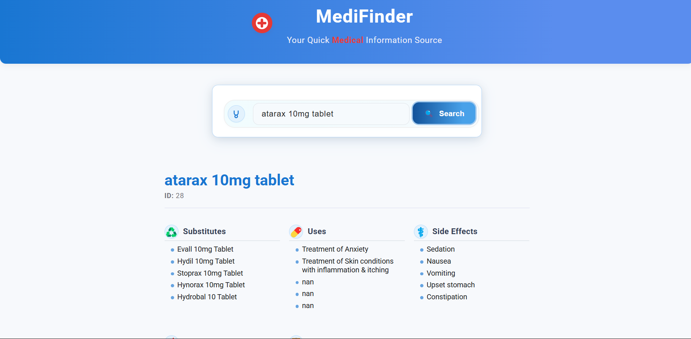

# PharmaSearch

PharmaSearch is a web application designed to provide quick and reliable medical information about various medicines. Users can search for a medicine and view details such as substitutes, uses, and side effects.

## Features
- Search for medicines by name.
- View substitutes for a medicine.
- Learn about the uses and side effects of medicines.
- User-friendly interface with a responsive design.

## Project Structure
```
PharmaSearch/
├── create_vector_database.py  # Script for creating a vector database for medicine data.
├── flask_app.py               # Main Flask application file.
├── README.md                  # Project documentation.
├── requirements.txt           # Python dependencies.
├── vercel.json                # Configuration for deployment on Vercel.
├── data/
│   ├── app_img.png            # Application image.
│   └── medicine_dataset.csv   # Dataset containing medicine information.
├── static/
│   ├── css/
│   │   └── style.css          # Stylesheet for the application.
│   └── js/
│       └── script.js          # JavaScript for client-side functionality.
└── templates/
    └── index.html             # HTML template for the application.
```

## Installation

1. Clone the repository:
   ```bash
   git clone https://github.com/your-username/PharmaSearch.git
   ```

2. Navigate to the project directory:
   ```bash
   cd PharmaSearch
   ```

3. Install the required dependencies:
   ```bash
   pip install -r requirements.txt
   ```

## Usage

1. Run the Flask application:
   ```bash
   python flask_app.py
   ```

2. Open your web browser and navigate to `http://127.0.0.1:5000`.

3. Use the search bar to find information about medicines.

## Preview

Below is a preview of the PharmaSearch application interface:



## Deployment

This project is configured for deployment on Vercel. Ensure the `vercel.json` file is correctly set up before deploying.

## Contributing

Contributions are welcome! Please fork the repository and submit a pull request for any improvements or bug fixes.

## License

This project is licensed under the MIT License. See the LICENSE file for details.